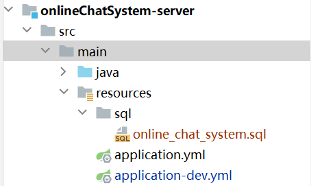

# 在线聊天系统后端

#### 介绍
  本项目是一个基于B/S架构前后端分离的在线聊天系统，旨在为用户提供一个简洁、高效的即时通讯平台。系统支持个人聊天、群聊、消息管理等功能，致力于提供用户友好、实时的交流体验。通过该平台，用户可以在不同设备上进行文字、表情、图片息传递，并能够管理自己的账户、好友以及聊天记录。

#### 软件架构
技术栈：SpringBoot、Spring、SpringMVC、SpringSecurity、knife4j等技术

#### 安装教程

1.  克隆
2.  配置application-dev.yml

  在上图中，需要自行配置数据库源，以及阿里云的oss存储对象，用于文件存储，具体参考下面代码

```
online-chat-system:
  datasource:
    host: localhost
    port: 3306
    username: root
    password:
    driver-class-name: com.mysql.cj.jdbc.Driver
    database: online_chat_system

  alioss:
    endpoint:
    access-key-id:
    access-key-secret:
    bucket-name:
    region:
```

3.  配置application.yml


  在上图中需要配置一些相关的配置，具体参考如下


```
server:
  port: 8080

spring:
  profiles:
    active: dev
  datasource:
    url: jdbc:mysql://${online-chat-system.datasource.host}:${online-chat-system.datasource.port}/${online-chat-system.datasource.database}?allowPublicKeyRetrieval=true
    username: ${online-chat-system.datasource.username}
    password: ${online-chat-system.datasource.password}
    driver-class-name: ${online-chat-system.datasource.driver-class-name}


mybatis-plus:
  configuration:
    default-enum-type-handler: com.baomidou.mybatisplus.core.handlers.MybatisEnumTypeHandler
  global-config:
    db-config:
      update-strategy: not_null
      id-type: auto

logging:
  level:
    com.gdpu: debug
    org.springdoc: debug
    com.github.xiaoymin.knife4j: debug


knife4j:
  enable: true
  openapi:
    title: 在线聊天系统接口文档
    description: "在线聊天系统接口文档"
    email: 3072740995@qq.com
    concat: MoRan
    url:
    version: v1.0.0
    group:
      default:
        group-name: default
        api-rule: package
        api-rule-resources:
          - com.gdpu.controller

online-chat-system:
  alioss:
    endpoint: ${online-chat-system.alioss.endpoint}
    access-key-id: ${online-chat-system.alioss.access-key-id}
    access-key-secret: ${online-chat-system.alioss.access-key-secret}
    bucket-name: ${online-chat-system.alioss.bucket-name}
    region: ${online-chat-system.alioss.region}
```
### 创建数据库

运行online-chat-system.sql语句

#### 使用说明

1.  建议使用jdk17,避免出现兼容性问题，因为本项目使用的jdk17


#### 前端项目访问


